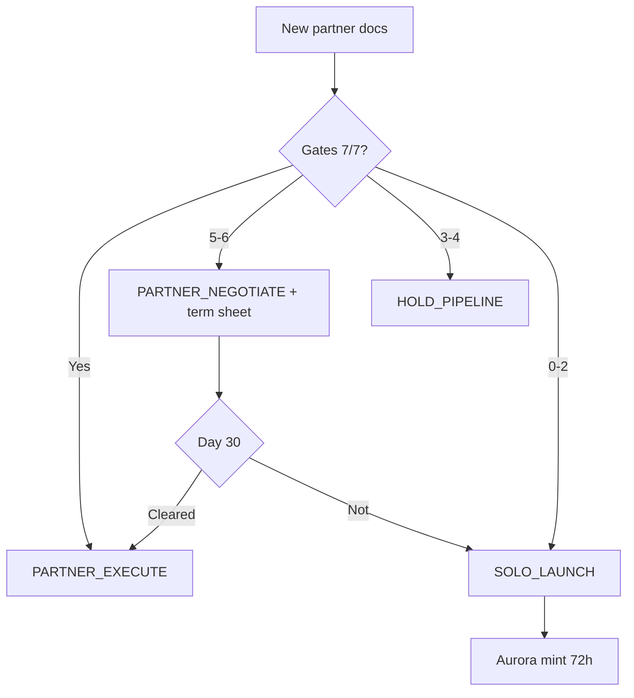

# T-LEV-8 Ecosystem Map

**Live site:** https://fthtrading.github.io/T-Lev-8-/  
**Repo:** https://github.com/FTHTrading/T-Lev-8-  
**Governor:** `@AI_SYSTEM/PROTOCOL_GOVERNANCE_PROMPT.md`

---

## Start here

| Role | Read first | Do first |
|------|------------|----------|
| **President / deal lead** | `OPERATIONS/72_HOUR_PLAYBOOK.md` | Send `STRATEGIC/JUDSON_EMAIL_FINAL.md` + PDFs |
| **AI agent** | `AI_SYSTEM/PROTOCOL_GOVERNANCE_PROMPT.md` | Evaluate partner → output DECISION/ACTION/RISK/TIMELINE |
| **Engineering** | `LAUNCH_NOW/QUICKSTART.md` | SOLO mint or partner integration post-gates |
| **Counsel** | `ANALYSIS/SOURCE_PDF_FINDINGS.md` | Review gates G1–G2 |
| **Compliance** | `COMPLIANCE/CONDITIONS_PRECEDENT.md` | Track G1–G7 |

---

## Directory tree

```
T-Lev-8-/
├── ECOSYSTEM.md                 ← You are here
├── index.html                   ← Deal room UI
├── data/governance-state.json   ← Machine-readable mode
│
├── AI_SYSTEM/
│   ├── PROTOCOL_GOVERNANCE_PROMPT.md   ← Algorithmic brain
│   ├── LEGAL_ARCHITECT_PROMPT.md
│   ├── REMINDER_BOT.md
│   └── KILL_SWITCH_MONITOR.md
│
├── LEGAL/
│   ├── MASTER_AGREEMENT.md
│   ├── REGULATORY_KILL_SWITCH.md
│   ├── TOKEN_LISTING_POLICY.md
│   ├── UNYKORN_MASTER_OPERATING_AGREEMENT.md
│   └── DEEP_DIVE_OPEN_SOURCE_AND_REGULATORY_FRAMEWORK.md
│
├── STRATEGIC/
│   ├── TERM_SHEET_FOR_JUDSON.md + .pdf
│   ├── JUDSON_EMAIL_FINAL.md
│   ├── UNIFIED_NEGOTIATION_POSITION.md
│   ├── SEND_VS_HOLD_MATRIX.md
│   ├── RETROSPECTIVE_LOG.md
│   ├── COUNTER_SYSTEM_... (INTERNAL)
│   └── COMPARISON_TABLE.md (INTERNAL)
│
├── COMPLIANCE/
│   ├── CONDITIONS_PRECEDENT.md
│   ├── CONDITIONS_CHECKLIST_FOR_JUDSON.md + .pdf
│   ├── HOWEY_TEST_WORKSHEET.md
│   └── STATE_AVAILABILITY_MATRIX.md
│
├── ANALYSIS/
│   ├── SOURCE_PDF_FINDINGS.md (INTERNAL)
│   └── SYSTEM_OVERVIEW_AND_VALUATION.md
│
├── PIPELINE/
│   └── PARTNER_PIPELINE.md
│
├── OPERATIONS/
│   └── 72_HOUR_PLAYBOOK.md
│
├── LAUNCH_NOW/
│   ├── QUICKSTART.md
│   └── AURORA_LAUNCH_PLAN.md
│
├── IPFS/
│   └── EXECUTION_MANIFEST.md
│
└── .github/workflows/
    ├── pages.yml
    ├── ai-legal-review.yml
    └── regulatory-test-suite.yml
```

---

## Decision flow (one page)



---

## External vs internal

| Send to Judson | Internal only |
|----------------|---------------|
| Term sheet PDF | Aurora brief |
| Conditions PDF | Comparison table |
| Master (after TS) | Source PDF findings |
| Email final | RETROSPECTIVE_LOG |

---

## Next moves (priority order)

1. **Enable GitHub Pages** — Settings → Actions  
2. **Email Judson** — `JUDSON_EMAIL_FINAL.md` + 2 PDFs  
3. **Log send date** in `PIPELINE/PARTNER_PIPELINE.md` + `governance-state.json`  
4. **Day 7** — `REMINDER_BOT.md` if no response  
5. **Day 30 or walk-away** — `72_HOUR_PLAYBOOK.md`  
6. **Counsel** — review `SOURCE_PDF_FINDINGS.md` + G2  

---

*Version 1.0 — 2026-05-20*
