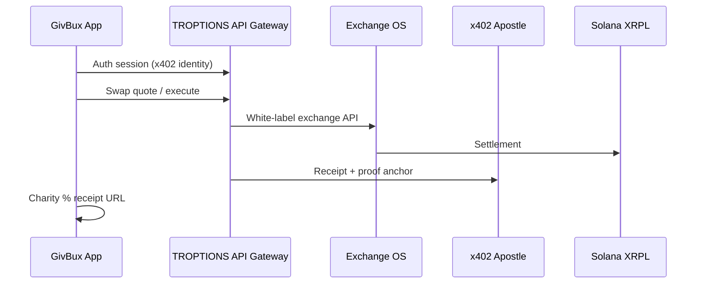

# GivBux 3.0 on TROPTIONS Rails — Architecture v0.1

**Model:** Hostile takeover **without buying shares** — replace broken GivBux tech with configured TROPTIONS stack; GivBux supplies brand + (maybe) users.  
**Prerequisite:** `STRATEGIC/GIVBUX_DISCOVERY.md` complete · Phase 0 funded · `COMPLIANCE/GIVBUX_OTC_RISK.md` cleared by counsel

---

## 1. Layer 0 — TROPTIONS owns everything

```
TROPTIONS Holdings (Wyoming)
├── Smart contracts (Solana / XRPL)     → TROPTIONS multisig
├── Middleware & API gateway            → Cloudflare Workers + EC2 x402
├── DONK / Finn AI models               → Licensed API; TROPTIONS retains IP
├── Exchange OS core                    → troptionslive (white-label instance)
├── Merchant rails                      → Direct TROPTIONS onboarding (bypass unnamed aggregator)
├── Treasury / fee capture              → 100% crypto fees → monthly rev-share settle
└── Kill switch                         → API revoke + contract pause (FTHEnforcer pattern)
```

GivBux does **not** receive repo access. GivBux receives: branded app shell + API keys + status dashboard.

---

## 2. Layer 1 — White-label "GivBux 3.0" mapping

| GivBux broken / promised feature | TROPTIONS component | Repo / URL | Config vs build |
|----------------------------------|---------------------|------------|-----------------|
| Cashback wallet | Solana SPL + XRPL custody SDK | `solana-launcher`, `troptions` wallet engines | **Configure** |
| Real-time crypto exchange (v2 PR) | Exchange OS white-label API | `troptionslive.unykorn.org/exchange-os` | **Configure** |
| Charity auto-donation % | Smart contract split + Impact portal | `impact.unykorn.org`, Apostle receipts | **Configure** + 1 escrow program |
| Cashback at retailers | Sponsor tiers + QR merchant OS | `troptions` sponsorCampaignEngine | **Configure** — direct merchants |
| eGifts | Fan Moment / NFT mint path | `troptionslive` sports mint flow | **Configure** |
| Affiliate / MLM commissions | — | **KILLED** | On-chain merchant rev share only |
| AI (v2 PR) | DONK + x402 + Finn routing | `UnyKorn-X402-aws`, needai | **Configure** API |
| Cloud biometrics (v2 PR) | x402 identity + IPFS profile | x402 gateway | **Configure** |
| AR / games (v2 PR) | Out of scope Phase 1–3 | Optional Phase 5+ SOW | **Defer** |
| National brand aggregator | Direct TROPTIONS merchant API | PayOps adapters | **Replace** middleman |
| Public proof / IR story | Apostle Chain 7332 + proof room | Apostle + IPFS | **Configure** |

**Key insight:** Their May 2024 "Real Time Crypto Exchange" is **already** Exchange OS. Do not rebuild.

---

## 3. Layer 2 — Request flow



---

## 4. Stablecoin & chain matrix (day-one target)

| Rail | Asset | Chain | TROPTIONS asset |
|------|-------|-------|-----------------|
| Primary | USDC, USDT | Solana | Launcher + Exchange OS |
| XRPL | RLUSD, USDGLO, USDF path | XRPL | `troptions` XRPL scripts, `fth-stablecoin-rail` |
| Proof | ATP receipts | Apostle 7332 | x402 gateway |
| EVM (optional) | USDF | Polygon/Ethereum | USDF Meridian — Phase 2+ |

---

## 5. Data migration protocol

| Data | Action |
|------|--------|
| User PII | GDPR/CCPA scrub; opt-in import only |
| Charity 501(c)(3) | Re-verify via IRS API; on-chain attestation |
| Affiliate tree | **Do not migrate** |
| Merchant contracts | Direct assignment to TROPTIONS entity; GivBux as agent only |
| Legacy app | Sunset; replace with SDK shell |

---

## 6. 90-day turnaround (if funded)

| Weeks | Work |
|-------|------|
| 1–2 | Phase 0 cash; legal scrub; architecture sign-off |
| 3–4 | Wallet + charity contracts testnet |
| 5–8 | Exchange white-label + 3 pilot merchants; MLM stripped |
| 9–12 | AI UAT; compliance dashboard; relaunch "Powered by TROPTIONS" |

---

## 7. What NOT to do

- Integrate **into** legacy GivBux backend without audit  
- Accept GBUX equity  
- Port MLM affiliate graph  
- Grant GitHub or production admin pre-Phase 0  
- Pause VEX / Sepolia for GivBux spec work  

---

## 8. Existing TROPTIONS completion context

~**58%** of a GivBux-class full stack already exists (horizontal infra). Remaining work is **white-label configure + GivBux-specific app shell + compliance scrub** — not greenfield. See `STRATEGIC/COST_AND_COMPLETION_BREAKDOWN.md`.

Phase fees in `LEGAL/GIVBUX_TERM_SHEET.md` reflect **distressed counterparty risk premium**, not marginal cost of code.
