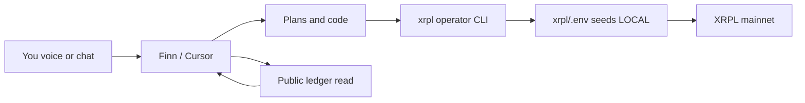

# UNYKORN Control Plane — One System, Local Keys, Full Stack

**You own the rails.** AI (Cursor/Finn) **plans, builds, audits, and demos** — it **never** holds your `sn...` seeds. Signing happens **only** on your PC via `xrpl/.env`.

---

## What you pasted from XRPL Scan (decoded)

### `rfbZz…` — **Ops wallet** (your seed)

| Item | Value |
|------|--------|
| XRP | 12.00 (~1.20 reserve) |
| RLUSD | **11.82** (limit 1M) |
| History | 20 XRP in → TrustSet → **Offer**: sold ~8 XRP for ~3.2 RLUSD → now holds RLUSD |

You already traded on DEX once. **No new trustline needed.**

### `rJLMST…` — **Production issuer** (`troptions.org`)

| Item | Value |
|------|--------|
| XRP | **1.20 only** — ⚠️ **HALTED for new issuance** |
| Issues | TROPTIONS, USDC 175M, USDT 100M, DAI 50M, EURC 50M |
| History | Mass mint to `rNX4fa…` (Apr 29–May 1); AMM create; domain set |

**Treasury IOUs are issued.** Issuer wallet is **out of XRP** for more mints until funded.

### `rPF2M1…` — **Bootstrap funnel** (deprecated label)

| Item | Value |
|------|--------|
| XRP | 3.00 left |
| History | Received 12 XRP → sent **3 XRP → rJLMST**, **5 XRP → rNX4fa** (Apr 28) |

This was a **pass-through**, not the live issuer. Scripts now default to `rJLMST…`.

### `rNX4fa…` — **Distribution + fees**

Holds the IOU balances; batch/platform fees route here.

---

## How the assistant works (honest model)



| Layer | Can do | Cannot do |
|-------|--------|-----------|
| **AI in Cursor** | Audit addresses, build batches/NFT plans, fix code, Exchange OS UI, deal room | Sign txs, read `.env`, spend your XRP |
| **Local CLI** (`npm run xrpl:operator`) | Sign with **your** seeds when you run it | Run without you enabling `MAINNET_SPEND_ENABLED` |
| **Finn voice** (optional) | Verbal status, trigger scripts you approve | Hold keys |

---

## Single command entry (run on your PC)

```powershell
cd C:\Users\Kevan\Documents\UNYKORN_Ecosystem\rwa-realestate
npm run xrpl:operator
```

Menu: audit all wallets · go-live check · batch scenarios · NFT plan · trustline check · ops smoke.

**Required once in `xrpl/.env`:** `XRPL_OPS_SEED`, `XRPL_ISSUER_SEED` (if separate), `MAINNET_SPEND_ENABLED=true` when you choose live.

---

## Fix issuer halt (10 XRP path)

Issuer has **1.20 XRP**. Need **~10+ XRP** on `rJLMST…` for reserves + mints.

**Paths (pick one):**

1. Send XRP from ops (`rfbZz…`) after swapping RLUSD→XRP on DEX (you sign locally).
2. Send from `rNX4fa…` if that wallet has spendable XRP.
3. External top-up to `rJLMST…` (no seed in chat).

Then: `npm run xrpl:audit` → issuer status OK → mint/NFT/batch at scale.

---

## Revenue + legal (already on GitHub)

| Pack | Link |
|------|------|
| Ferrari pitch | `OPERATIONS/THE_FERRARI_STORY.md` |
| IOU disclaimer | `LEGAL/IOU_DISCLAIMER.md` |
| Judson | `STRATEGIC/JUDSON_EMAIL_FINAL.md` |
| Batch money | `rwa-realestate` scenarios + `/exchange-os/batch` |

---

## Voice (“communicate verbally”)

**Finn** (`C:\Users\Kevan\.agents\skills\finn-voice-pipeline`) is the local voice stack (Whisper + Piper). Wire it to read `xrpl/ledger-wallet-audit.json` and `OPERATIONS/CURRENT_STATUS.md` for spoken status — keys stay in env, voice only triggers **approved** npm scripts.

---

## Highest-level organization

| Tier | Repo / surface |
|------|----------------|
| **Command** | `T-Lev-8-` deal room + OPERATIONS/* |
| **XRPL engine** | `rwa-realestate/xrpl/` |
| **Exchange + Batch UI** | `troptions` Exchange OS |
| **Voice ops** | Finn (local) |

**Rule:** One canonical issuer (`rJLMST…`), one fee wallet (`rNX4fa…`), one ops signer (`rfbZz…`). Retire `rPF2M1…` in new scripts.
