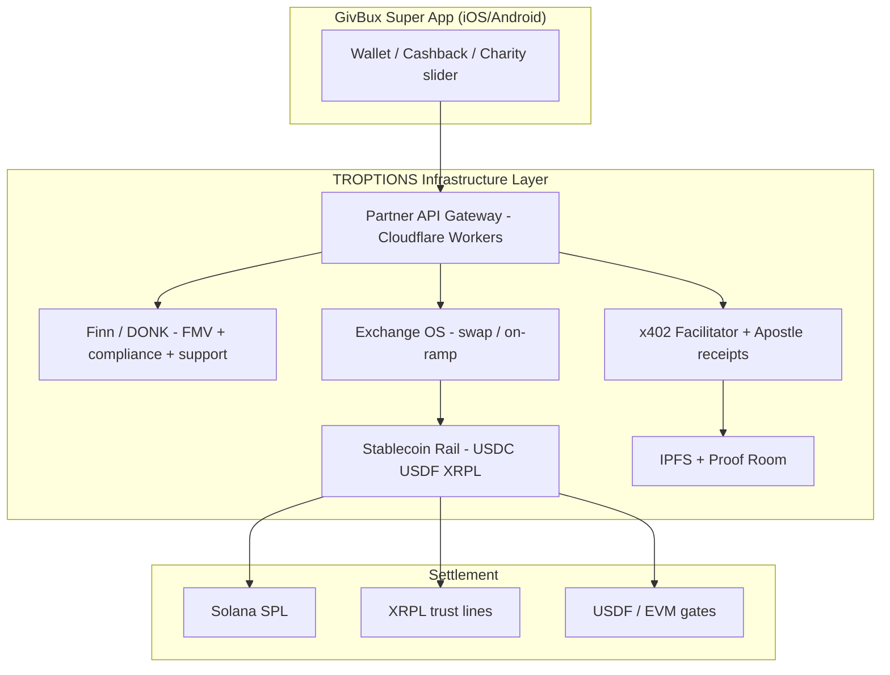

# GivBux (OTC: GBUX) — Integration Architecture & Outreach

**Company:** GivBux, Inc. — Newport Beach, CA  
**Sites:** givbux.com (live app marketing) · givbuxsuperapp.com (**still “Launching Soon”**)  
**IR:** IR@GivBux.com · **CS:** cs@givbux.com  
**SEC CIK:** 0001169138

**Your ask:** They want FTH/TROPTIONS to scope **full system + AI + XRPL + stablecoins + infrastructure**.  
**Reality:** No public developer API today — engagement is **partnership / white-label**, not SDK integration.

---

## Strategic overlap

| GivBux (today / v2 claim) | TROPTIONS built | Integration viability |
|---------------------------|-----------------|------------------------|
| Cashback 100+ retailers | Sponsor tiers + QR merchant OS | Low (they own merchant rails) |
| Auto charity % → 501(c)(3) | Impact portal + Apostle proof | **Medium** — white-label charity rail |
| “Real-time crypto exchange” (v2 PR) | Exchange OS + Jupiter/Meteora | **High** — white-label DEX/settlement |
| Mobile wallet / P2P | Solana + XRPL + USDF rail | **High** — backend only |
| eGifts | Fan Moment / NFT mint | Low (different UX) |
| Public OTC co | On-chain proof for IR | **High** — transparency story |

---

## Reference architecture (what you would build for them)

### Rail-by-rail

| Flow | Implementation |
|------|----------------|
| User donates % of purchase | Impact ledger + 501(c)(3) webhook; settle USDC via PayOps |
| Crypto → GivBux balance | Exchange OS quote; x402 receipt; optional auto-convert policy |
| P2P send | XRPL Payment + Solana transfer; KYC gate from T-Build |
| Merchant cashback | Map to existing sponsor QR infra (if co-marketing, not deep GBUX POS) |
| IR / proof dashboard | Apostle anchors + public proof URL (no PII on-chain) |

---

## Phased delivery (for proposal)

| Phase | Weeks | Deliverable | Depends on |
|-------|-------|-------------|------------|
| 0 Discovery | 2 | Signed NDA + API contract spec (they must expose webhooks) | GBUX eng contact |
| 1 Settlement MVP | 6 | XRPL + USDC rail behind single Partner API | RPC keys, KYC vendor |
| 2 Exchange | 4 | White-label swap + convert-to-USD policy | Liquidity commitment |
| 3 AI layer | 4 | Support bot + fraud/compliance screening | Model hosting |
| 4 Charity | 4 | Auto-allocate % + impact.unykorn.org reporting | 501(c)(3) partners |
| 5 Public proof | 2 | IR dashboard anchors | Apostle production |

**Phase 1–2 only (MVP):** ~$120K–200K fixed + 0.25–0.5% settlement bps (indicative).  
**Full diagram above:** ~$280K–450K + ops — aligns with `COST_AND_COMPLETION_BREAKDOWN.md`.

---

## Blockers (must clear in discovery call)

1. Is v2 crypto exchange **live**? Which chains/tokens?  
2. Will they expose **REST/webhooks** or only batch files?  
3. Money transmitter / MSB posture for converted balances?  
4. Who holds user wallets — GBUX custodial vs TROPTIONS non-custodial?  
5. Charity disbursement — registry of approved nonprofits?

Until answered: **do not promise app store integration**.

---

## Cold outreach — IR@GivBux.com

**Subject:** TROPTIONS infrastructure proposal — crypto exchange, XRPL, and stablecoin rails for Super App v2

Dear GivBux Investor Relations team,

We are FTH Trading / TROPTIONS — we operate live Solana event-commerce infrastructure (merchant QR activation, exchange routing, and multi-chain settlement) and are reviewing GivBux’s Super App v2 roadmap, including the May 2024 announcement on real-time crypto conversion and expanded social features.

Rather than a consumer app compete, we are proposing a **white-label infrastructure partnership**:

- **Settlement:** XRPL + Solana + USDC/USDF stablecoin rails with sub-cent settlement and auditable receipts  
- **Exchange layer:** Configurable swap and auto-convert policies (similar to your stated “accept partner token → GivBux balance” flow)  
- **AI operations:** Compliance screening, support automation, and transaction explanation layers  
- **Charity / impact:** Verifiable %-of-purchase allocation with public proof (aligned with your core giving mission)  
- **Public-company transparency:** On-chain proof artifacts suitable for IR disclosure (no consumer PII on-chain)

We have already invested substantial engineering in these rails; a discovery call could map what remains versus a 90-day MVP. We are not asking for your consumer merchant contracts — only API access, compliance boundaries, and a technical counterpart.

Could we schedule 30 minutes with your product or technology lead and IR counsel present?

Best regards,  
[Name]  
FTH Trading / TROPTIONS  
https://fthtrading.github.io/T-Lev-8-/  
https://troptionslive.unykorn.org/exchange-os

---

## Recommendation

| Path | Action |
|------|--------|
| **GivBux** | Send IR email; pull SEC filings for v2 delivery claims; require API spec before build |
| **LEV8/Judson** | Finish Sepolia gate + term sheet — Aurora uses same infra map |
| **Ignore** | Building GBUX-specific app shell before API exists |

**Bottom line:** You are **not starting from zero** — you are productizing ~58% of a super-app backend already. GivBux needs you because their v2 landing page is still dead; your risk is scope creep without a signed SOW and API contract.
